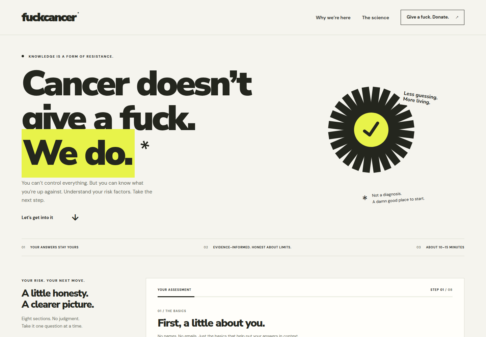

<div align="center">

# fuckcancer

**Know your risk factors. Make a plan.**

A private, client-side cancer risk-factor questionnaire. No backend, no accounts, no tracking — your answers never leave your browser.

[](https://github.com/roryjmahoney/fuckcancer/actions/workflows/ci.yml)
[](LICENSE)
[](.nvmrc)
[](#privacy)

<picture>
  <source media="(prefers-color-scheme: dark)" srcset="docs/screenshots/dark.png">
  
</picture>

</div>

---

> [!CAUTION]
> **This is not a medical diagnosis, and the scores are not validated.**
>
> fuckcancer is an educational tool. It adds up **self-reported risk factors** using
> weights that were authored by hand and are disclosed in the app. The number it shows you
> is **not a percentage chance of cancer**, not a lifetime probability, not a screening
> recommendation, and not a substitute for a clinician. A low score cannot rule cancer out.
> A high score does not mean you have it.
>
> If you are worried about a symptom, or about your family history, talk to a doctor.
> Start with the [National Cancer Institute's risk-factor information](https://www.cancer.gov/about-cancer/causes-prevention/risk).
>
> Read [Medical limitations](#medical-limitations) before you deploy this anywhere.

---

## Contents

- [What it is](#what-it-is)
- [Quick start](#quick-start)
- [Scripts](#scripts)
- [What it asks](#what-it-asks)
- [What it reports](#what-it-reports)
- [Ages 14–17](#ages-1417)
- [Medical limitations](#medical-limitations)
- [Privacy](#privacy)
- [Deploying](#deploying)
- [Architecture](#architecture)
- [Testing](#testing)
- [Design notes](#design-notes)
- [Contributing](#contributing)
- [Sources](#sources)
- [License](#license)

## What it is

A single-page web app that walks you through a detailed questionnaire about the things
that are actually associated with cancer — tobacco, alcohol, family history, sun and
occupational exposure, diet and movement, medical history — and then shows you a plain
breakdown of which of *your* answers flagged, for which cancers, and what you could
actually do next.

It is deliberately small and deliberately dumb in the right places:

- **No backend.** It is static files. There is nothing to run on a server.
- **No accounts, no email, no names.** It never asks who you are.
- **Nothing is stored.** Answers live in a JavaScript variable and die when you close the
  tab. No cookies, no `localStorage`, no analytics, no network request of any kind.
- **Honest about its limits.** Every score is shown next to what it does and does not
  mean, and the full scoring methodology is printed in the app, not hidden in the code.

Built with [Vite](https://vite.dev/) and vanilla ES modules. Two runtime dependencies,
both of them fonts.

## Quick start

Requires **Node.js 22.12 or newer** (see [`.nvmrc`](.nvmrc)).

```bash
git clone https://github.com/roryjmahoney/fuckcancer.git
```

```bash
cd fuckcancer && npm ci && npm run dev
```

Open the URL Vite prints, usually <http://localhost:5173>.

To build the static site:

```bash
npm run build
```

The result lands in `dist/` — around 55 kB of JavaScript and 27 kB of CSS before gzip,
plus self-hosted font files. Upload it to any static host. There are no environment
variables, API keys or secrets to configure.

## Scripts

| Command | What it does |
| --- | --- |
| `npm run dev` | Vite dev server with hot reload. |
| `npm run build` | Production build into `dist/`. |
| `npm run preview` | Serve the built `dist/` locally to check it. |
| `npm test` | 20 unit tests for scoring, validation and bounds, via Node's built-in test runner. |
| `npm run test:e2e` | 5 Playwright browser journeys, including `axe` accessibility checks. |

> [!WARNING]
> `npm run dev` and `npm run preview` bind to `0.0.0.0`, which exposes them to everything
> on your network. They are development servers — never use either one as a public
> production server. Serve the built `dist/` from a real static host instead.

The browser suite needs Chromium:

```bash
npx playwright install --with-deps chromium
```

If you already have a Chromium build and would rather not download another, point
Playwright at it:

```bash
PLAYWRIGHT_CHROMIUM_EXECUTABLE_PATH=/usr/bin/chromium npm run test:e2e
```

## What it asks

Eight sections, 51 fields on the adult path, 8 of which appear conditionally based on
earlier answers. Every question is optional and every question offers an explicit
*"Not sure / prefer not to say"*.

| # | Section | Covers |
| --- | --- | --- |
| 1 | The basics | Age, sex assigned at birth, gender identity, ethnicity, height and weight. |
| 2 | Smoking & alcohol | Current / former / never, cigarettes per day, years smoked, years since quitting, other tobacco and nicotine products, secondhand smoke, weekly alcohol. |
| 3 | Family history | Whether blood relatives have had cancer, which relatives, which cancers and at what age, and any known inherited cancer-risk variant. |
| 4 | Food & movement | Moderate activity per week, daily sitting time, processed and red meat, whole grains, beans, fruit and vegetables. |
| 5 | Sun & environment | Midday sun exposure, sun protection, severe sunburns, tanning beds, how your skin reacts to sun, occupational carcinogens, home radon. |
| 6 | Medical history | Previous diagnosis and when, previous radiation therapy, polyps or IBD, type 2 diabetes, persistent infection, long-term immune suppression, current unexplained symptoms. |
| 7 | Hormones & anatomy | Which organs you actually have, menopause status, hormone use, age at first period, first full-term pregnancy, breastfeeding. |
| 8 | Review & results | Screening status, an explicit acknowledgement that this is not a diagnosis, and a full review-and-edit pass before anything is calculated. |

Height and weight accept **metric (cm/kg) or imperial (ft + in/lb)**, with paired feet and
inches inputs and automatic conversion when you switch units — nobody should have to do
arithmetic to answer a health questionnaire.

Which organs you have is asked **explicitly and separately from gender identity**, so the
results apply to your anatomy rather than to an assumption about it. Profiles for organs
you do not have are excluded entirely.

## What it reports

- **An overall factor index (0–100)** — the highest applicable cancer profile, not an
  average.
- **Twelve cancer profiles**, each with its own score and a per-factor explanation of
  every point it awarded: lung, breast, colorectal, prostate, skin/melanoma, pancreatic,
  bladder, kidney, liver, cervical, ovarian, and uterine/endometrial.
- **BMI and pack-years** where they apply. BMI is only shown or scored from age 20 up;
  below that, age-specific clinical interpretation would be required and this tool does
  not attempt it.
- **A data-completeness count.** Unknown answers score zero points but are counted and
  displayed as missing, so you can see when the picture is thin. An unanswered question is
  never treated as a confirmed absence of risk.
- **Follow-up alerts that fire regardless of your score** — for current symptoms, a
  previous diagnosis, a known inherited variant, or family history. These exist precisely
  because a low number should never talk someone out of seeing a doctor.
- **The full methodology**, printed in the app: every weight, every threshold, every band,
  and an explicit list of the factors that are collected for context but deliberately
  *not* scored.
- **Real resources** — NCI, ACS and CDC — and a donation link to
  [St. Jude Children's Research Hospital](https://www.stjude.org/donate/donate-to-st-jude.html).

You can review and edit any answer, print or save the results, and reset everything with a
confirmation step.

## Ages 14–17

Teenagers get a different path, because adult cancer models do not apply to them and
pretending otherwise would be worse than useless.

- The adult cancer indices, adult screening prompts, and the hormone and anatomy section
  are **not** shown. Section 7 is replaced with optional vaccination and support
  questions. The teen path has 43 fields.
- Instead of cancer profiles, teens get a single **0–100 reported-exposure score**,
  labelled in the interface as *"Unvalidated and potentially inaccurate"* and *"Not a
  percentage chance of cancer"*, with a full breakdown of the points.
- Its weights are arbitrary and fully disclosed: tobacco up to 25, alcohol 5–15 by weekly
  category, UV exposure up to 25, secondhand smoke 10, listed harmful substances 15, radon
  10. Vaping alone scores nothing. If every scoring input is missing, no score is shown at
  all.
- Medical history, symptoms, genetics, identity, body size and vaccination status are
  **not** converted into points — they route to follow-up guidance instead.
- The app states plainly that childhood and adolescent cancers differ from adult cancers,
  that habits do not explain most childhood cancers, and that a diagnosis is never the
  young person's fault.

## Medical limitations

**Read this before you publish, deploy, fork or share this.**

The app is a runnable static website. **Its scoring is not clinically validated.** It must
not be represented as a medical device, a diagnostic test, a screening-eligibility tool or
a validated individual cancer-risk calculator. Clinical review and validation would be
required before any clinical deployment.

**The index is not a probability.** For adults 18+, the 0–100 number is an editorial
weighted inventory of reported factors. It is not a percentage, not a lifetime risk, and
not time-bound. Association *directions* are informed by the National Cancer Institute;
the weights, thresholds and the way they are added together are authored heuristics. They
do not reproduce any established model — not Gail/BCRAT, not Tyrer–Cuzick, not PLCO, not
QCancer.

**The math is deliberately simple.** Each profile adds points and caps at 100. Age
contributes 0, 10 or 20; other factors contribute 4–40. The overall index is the maximum
applicable profile, not an average. The bands — 0–24, 25–49, 50–100 — mean *fewer / some /
more reported factors*, not clinical low / medium / high risk. Additive weights ignore how
factors interact, how long an exposure lasted, genetics, geography and most medical
detail. Scores for different cancers are not comparable incidence estimates.

**Missing data cuts one way.** Unknown answers contribute no points and are prominently
counted as missing. Incomplete answers therefore *understate* the factor profile. No
factor, and no combination of factors, rules cancer out.

**Some things are collected but not scored.** Sex, gender, ethnicity, reproductive
history, sitting time, other tobacco products, *H. pylori* and benzene are discussion
context only. This is disclosed in the app's methodology rather than buried. Demographic
identity labels are never converted into points. Absent organs are excluded, but surgery
and residual tissue need a clinician's interpretation.

**Some answers bypass the score entirely.** A previous cancer diagnosis, a known genetic
variant, or current symptoms trigger advice to seek individual clinical guidance no matter
what the index says.

**The teen score is the least validated part of the whole thing.** See
[Ages 14–17](#ages-1417). It does not attempt to score leukemia, brain tumours or any
other childhood cancer.

**Known gaps in this release, stated plainly.** These are open issues, not secrets:

- The **prostate** and **ovarian** profiles have no modelled risk factors at all. They can
  only ever return age plus family history, so they will sit in the lowest band for
  everyone. Do not read that as reassurance — it is a model that was never built.
- Each profile's "missing information" count omits some inputs that genuinely score that
  profile, so per-card incompleteness is **under**-reported.
- The adult caveat interpolates the score, so a clean-history user sees "This is NOT a 0%
  chance of cancer." — clumsy phrasing for exactly the reader most likely to misread it.
- Every adult factor's "Evidence" link resolves to the same general NCI page rather than
  to a source for that specific weight.
- The teen exposure score is not clamped; its 0–100 range holds only because the current
  weights happen to sum to 100.
- The St. Jude donation block renders on the teen results screen as well as the adult one.

The full list, with file references, is at the end of
[`docs/IMPLEMENTATION.md`](docs/IMPLEMENTATION.md).

The automated tests in this repository check code behavior. They are not clinical
validation and not an accessibility certification.

## Privacy

This is the part the project actually takes seriously.

- **Answers never leave the browser.** There is no `fetch`, no `XMLHttpRequest`, no
  `sendBeacon`, no WebSocket, no form POST and no third-party embed anywhere in `src/`.
- **Nothing is persisted.** No cookies, no `localStorage`, no `sessionStorage`, no
  IndexedDB. Close the tab and it is gone. Someone may be filling this in on a shared,
  borrowed or family computer.
- **No tracking.** No analytics, no pixels, no error reporting, no A/B tooling.
- **No remote fonts.** Nunito Sans and DM Sans are self-hosted through Fontsource, so
  there is no request to a font CDN either.
- **Hardened headers.** [`public/_headers`](public/_headers) ships a Content-Security-Policy
  restricting scripts, styles, fonts and connections to `'self'`, with `object-src 'none'`,
  `frame-ancestors 'none'`, `form-action 'none'`, `X-Content-Type-Options: nosniff`,
  `Referrer-Policy: no-referrer` and a `Permissions-Policy` denying camera, microphone and
  geolocation.

The first three of those are *asserted by the test suite*, not just claimed:
[`tests/browser/app.spec.js`](tests/browser/app.spec.js) records every network request
during a full journey and fails if any of them is a non-`GET` or leaves the origin, checks
that `localStorage`, `sessionStorage` and `document.cookie` are all empty at the results
screen, and reloads the page to confirm the answers are gone. A change that starts phoning
home should fail CI.

The headers bullet is **not** covered by a test — nothing in the suite serves `dist/` with
`_headers` applied — and `indexedDB` and the Cache API are verified by source inspection
rather than at runtime. If you are auditing this, treat those two as claims to check
yourself rather than as facts CI is guarding.

## Deploying

Build, then upload `dist/` to any HTTPS static host.

```bash
npm run build
```

**Netlify and Cloudflare Pages are the supported targets.** `public/_headers` is copied
into `dist/` at build time and both of those hosts read it directly, so the CSP and the
rest of the hardening arrive with the site.

**GitHub Pages cannot set custom response headers at all.** A Pages deployment therefore
ships with **no** Content-Security-Policy and none of the other headers — `_headers` is
inert there, not merely unread. If you publish to Pages anyway, do it through
[`.github/workflows/deploy-pages.yml`](.github/workflows/deploy-pages.yml): a project
Pages site is served from `/<repo>/`, so the build needs `--base=/<repo>/` and a
hand-built `dist/` uploaded to Pages will 404 every asset without it. The workflow does
not run on push — enable Pages, then publish a release or trigger it manually.

On any other host — S3 + CloudFront, nginx, Caddy — configure the equivalent headers in
your server or CDN config. A static site with the CSP stripped off is a meaningfully
weaker thing than the one described above.

Use `npm ci` against the committed lockfile so builds are reproducible. Do not expose
`npm run dev` or `npm run preview` publicly.

If you deploy a public instance, keep the disclaimers intact. They are not decoration.

## Architecture

```
index.html                  Entry point, meta, skip link, no-JS fallback
playwright.config.js        Browser-test config: test dir, base URL, dev-server lifecycle
public/
  _headers                  CSP and hardening headers for Netlify / Cloudflare Pages
  favicon.svg
  licenses/                 SIL OFL texts for the bundled fonts, emitted into dist/
src/
  questions.js              Questionnaire schema: sections, fields, choices, conditional visibility
  assessment.js             Pure model: validation, BMI, pack-years, disclosed scoring rules — no DOM
  app.js                    Rendering, in-memory state, navigation, results, dialogs, printing
  style.css                 Layout, themes, reduced motion, print styles
tests/
  assessment.test.js        20 unit tests against the model
  browser/app.spec.js       5 Playwright journeys with axe accessibility checks
docs/
  IMPLEMENTATION.md         Running implementation and verification log
  screenshots/              Light and dark captures used by this README
.github/
  workflows/ci.yml          Unit tests, browser tests and build on every push and PR
  workflows/deploy-pages.yml  Optional, manual/on-release GitHub Pages deployment
  ISSUE_TEMPLATE/           Bug, content-accuracy and feature-request forms
  PULL_REQUEST_TEMPLATE.md
  dependabot.yml
LICENSE  README.md  CHANGELOG.md  CONTRIBUTING.md  CODE_OF_CONDUCT.md  SECURITY.md
```

The split is the point: `questions.js` owns *what is asked*, `assessment.js` owns *what it
means* as pure functions with no DOM access so the model can be tested directly, and
`app.js` owns *how it looks and behaves*. Scoring changes should never require touching
rendering code.

## Testing

```bash
npm test          # 20 unit tests: tobacco dose, unknown data, organ applicability,
                  # validation, family history, result bounds, teen scoring
npm run test:e2e  # 5 browser journeys
npm run build     # must succeed
```

The Playwright suite covers a full adult journey with conditional fields, review, editing
and reset; light and dark accessibility passes with mobile layout checks; a privacy and
dialog pass that asserts no answers are submitted and nothing is persisted; a narrow-mobile
journey that revalidates edited earlier answers; and a 14-year-old journey that exercises
feet-plus-inches input and the labelled teen exposure score. `axe` runs in both themes and
on the results view, and layouts are checked at 320px and 390px.

CI runs all three on every push and pull request — see
[`.github/workflows/ci.yml`](.github/workflows/ci.yml).

## Design notes

The look is paper, ink and one aggressive yellow. Nunito Sans for display, DM Sans for
body. Solid surfaces, heavy type, deliberate asymmetry, restrained motion.

It is built to *not* look AI-generated, which in practice means a standing list of things
it will not do: no generic system sans as display type, no purple or indigo gradients, no
glassmorphism, no evenly spaced three-card feature rows, no blanket `rounded-3xl`, no neon
glow on dark, no icon-chip soup, no symmetrical SaaS-template layout, no vague corporate
copy. If a pull request reintroduces one of those, that is a review comment.

Light and dark follow the system preference. Reduced motion is respected. Everything is
keyboard-operable with visible focus, dialogs are accessible, and there is a print
stylesheet so results can be taken to an actual appointment.

## Contributing

Bug reports, accessibility fixes and — especially — **sourced corrections to the medical
content** are welcome. See [CONTRIBUTING.md](CONTRIBUTING.md) for setup, the
non-negotiable constraints (no backend, no data leaving the browser, no persistence, no
tracking), and what a scoring change needs to include.

- Found a bug? Use the **Bug report** issue template.
- Something in the content is wrong, misleading or unsourced? Use the **Content or
  accuracy correction** template. That is the most valuable issue you can file here.
- Found a security or privacy vulnerability? **Do not open a public issue** — follow
  [SECURITY.md](SECURITY.md).

Everyone participating is covered by the [Code of Conduct](CODE_OF_CONDUCT.md). The name
is aimed at a disease, not at people.

## Sources

Reviewed September 2026.

- [NCI — Cancer risk factors](https://www.cancer.gov/about-cancer/causes-prevention/risk)
- [NCI — Cancer prevention overview (PDQ)](https://www.cancer.gov/about-cancer/causes-prevention/patient-prevention-overview-pdq)
- [NCI — Cancer in children and adolescents](https://www.cancer.gov/types/childhood-cancers/child-adolescent-cancers-fact-sheet)
- [ACS — Cancer screening guidelines](https://www.cancer.org/cancer/screening/american-cancer-society-guidelines-for-the-early-detection-of-cancer.html)
- [CDC — Preventing cancer](https://www.cdc.gov/cancer/prevention/index.html)
- [CDC — Child and teen BMI](https://www.cdc.gov/bmi/child-teen-calculator/bmi-categories.html)
- [St. Jude Children's Research Hospital — Donate](https://www.stjude.org/donate/donate-to-st-jude.html)

**This is an independent project. It is not affiliated with, endorsed by, or reviewed by
any of these organizations.**

## License

[MIT](LICENSE) © 2026 Rory Mahoney.

Nunito Sans and DM Sans are distributed under the
[SIL Open Font License 1.1](public/licenses/). Because the OFL requires that notice to
travel with the font files, both license texts live in
[`public/licenses/`](public/licenses/) and are emitted into `dist/` at build time — so a
deployed copy of this site carries them too.

---

<div align="center">

Cancer doesn't give a fuck. We do.

</div>
